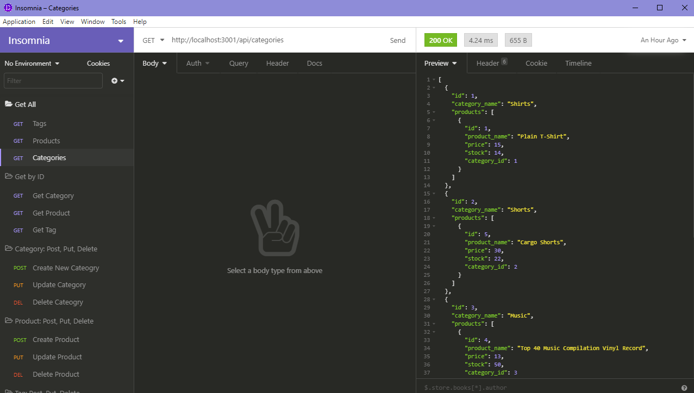
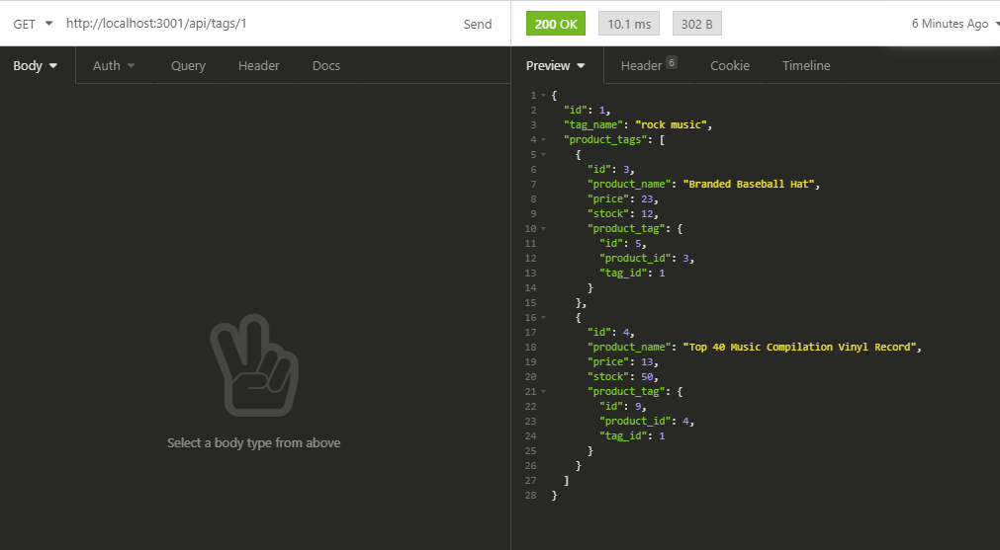
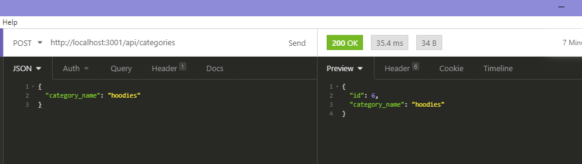

# E-Commerce

## Description
This challenge is to build the back end for an e-commerce site. You’ll take a working Express.js API and configure it to use Sequelize to interact with a MySQL database.

## Screenshot
Get All Request

Get By ID

Create

## Video Link
https://drive.google.com/file/d/1B61CLF_8Dt32r19RxFqFiQvnStaDiUpr/view
